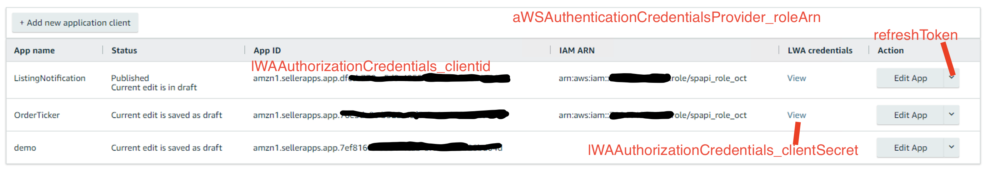

##  selling-partner-api-bootstrap

This project is a sample implementation of how to implement `rate limiter` and `authentication` for Amazon Selling Partner API.

This implementation followed the official document [here](https://github.com/amzn/selling-partner-api-docs).

### Overview
This project consist of two parts, one is CDK script which is able to deploy everything by one command. The other part is the Java code that pull `Orders` from SP-API, it is triggered by a timer in `EventBridge` every minute for **all** sellers in the `credentials` table. Also `Fulfillment` API is implemented to demo the SP-API `subscription` mode, which first receive notification from `EventBridge`. 

It is based on serverless architecture, and used services are `DynamoDB, Lambda, EventBridge, ElasticCache, CloudWatch`. CDK scripts will start from create VPC and most of the code is running inside the VPC. After the execution of CDK scripts everything is provisioned on AWS. You should go and check the DynamoDB table, and you should put seller credentials into the table. One helper class called `InitCredentialsTableHelper` is provided to easy this process.

The value of the credentials can be found from the following picture.

`RateLimter` is implemented by utilize `Redis on ElasticCache`, so seprate Lambda instances will share the same limiter during the pulling. The RateLimter will dynamically update the rate according to the HTTP header responded from server side.

Separate `README.md` are included in each sub-folder.

## Contribute
Pull requests and issue reports are welcome.

## Security

See [CONTRIBUTING](CONTRIBUTING.md#security-issue-notifications) for more information.

## License

This library is licensed under the MIT-0 License. See the LICENSE file.

